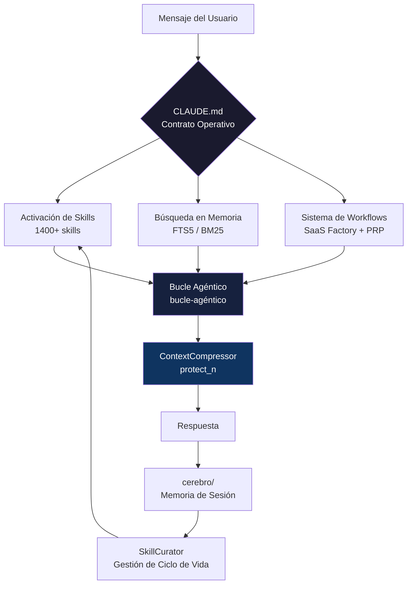
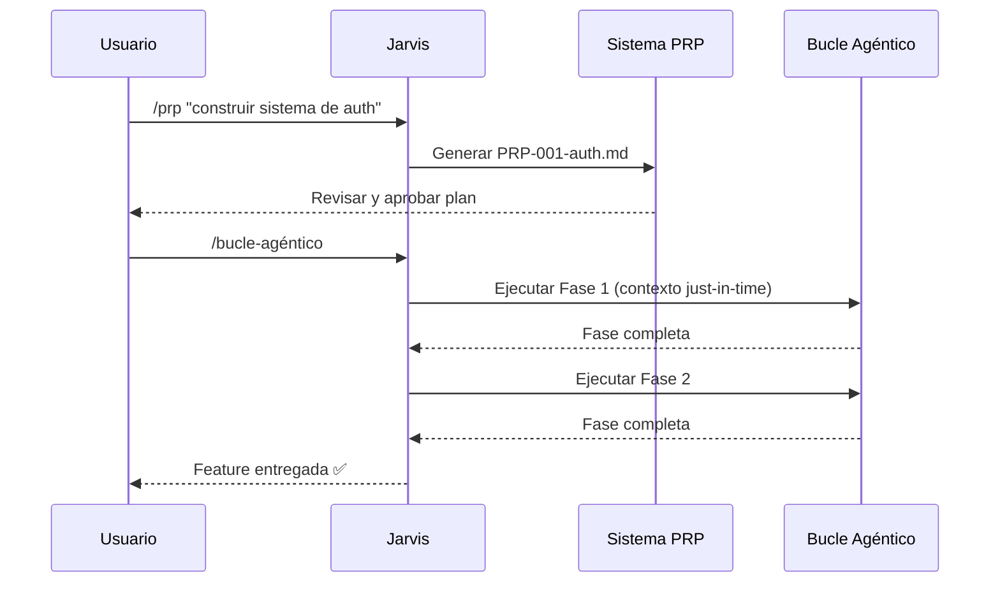

<div align="center">

<!-- BANNER PLACEHOLDER — reemplazar con tu imagen -->
<!--  -->

# 🤖 Jarvis-254-Agent

### El co-piloto de ingeniería IA open source que unifica lo mejor que la comunidad ha construido — en un sistema estructurado y portable.

[](https://github.com/Ignvvcio254/Jarvis-254-Agent/actions/workflows/ci.yml)
[](LICENSE)
[](#-skills--1400-skills-procedurales)
[](https://www.python.org/)
[](https://github.com/Ignvvcio254/Jarvis-254-Agent/stargazers)

**No es un reemplazo. No es un fork. Es una unificación.**

[📦 Instalar](#-instalación) · [⚡ Inicio Rápido](#-inicio-rápido) · [📖 Docs](docs/README.md) · [🤝 Créditos](#-créditos--comunidad) · [🛠 Contribuir](CONTRIBUTING.md)

---

🌐 **Idioma / Language:**
[](README.md)
[](README.es.md)

</div>

---

## 🧠 ¿Qué es esto?

La mayoría de los setups de agentes IA son buenos **de forma aislada**.

| Problema | Realidad |
|---|---|
| Gran contrato CLAUDE.md | Pero sin memoria persistente entre sesiones |
| 1400 skills de la comunidad | Pero sin curación de ciclo de vida — se degradan con el tiempo |
| Runtime poderoso | Pero sin sistema estructurado de workflows |
| Loop de aprendizaje de Hermes | Pero bloqueado a un solo proveedor |

**Jarvis-254-Agent los unifica.**

Toma los mejores patrones del ecosistema open source — NousResearch/hermes-agent, Antigravity, SaaS Factory, claude-brain, y más — y los compone en un **sistema único, estructurado y portable** que puedes clonar en minutos y usar inmediatamente.

> 💡 **No somos dueños de ninguno de estos sistemas. Los curamos, acreditamos y componemos.**

---

## ⚡ Inicio Rápido

```bash
# 1. Clonar
git clone https://github.com/Ignvvcio254/Jarvis-254-Agent.git
cd Jarvis-254-Agent

# 2. Diagnosticar tu setup al instante
python jarvis_doctor.py --repo-only

# 3. Planear tu primera tarea
python jarvis_runtime.py plan --intent "construir una API REST con FastAPI"

# 4. Buscar en tu wiki de memoria (FTS5 BM25 — cero dependencias)
python jarvis_runtime.py memory search "patrones de autenticación"
```

> ✅ Sin npm. Sin Docker. Sin cuenta cloud requerida.

---

## 📊 Antes vs Después

| Sin Jarvis-254 | Con Jarvis-254 |
|---|---|
| Re-explicar contexto en cada sesión | Wiki de memoria persistente + búsqueda FTS5 |
| Skills que se degradan y quedan obsoletas | Auto-curador marca las obsoletas, archiva las antiguas |
| Lock-in de un solo proveedor | Adaptador multi-proveedor con cadena de fallback |
| Archivos de prompts planos y dispersos | CLAUDE.md estructurado como contrato operativo |
| Sin sistema de workflows | SaaS Factory: PRP + bucle agéntico |
| Consumo ilimitado de contexto | Compresión protect_n (patrón Hermes) |
| Comportamiento genérico del agente | 1400+ skills procedurales por dominio |

---

## 🏗 Arquitectura

```
Jarvis-254-Agent/
│
├── 🧠 CLAUDE.md              ← Contrato operativo del agente (el núcleo)
├── ⚙️  jarvis_runtime.py      ← CLI del runtime ejecutable
├── 🩺 jarvis_doctor.py       ← Diagnósticos de setup
│
├── 💬 commands/              ← Slash commands (/memoria, /consumo, /curator...)
├── 🎯 skills/                ← 1400+ skills procedurales por dominio
├── 📏 rules/                 ← Reglas de ingeniería por stack
├── 💾 cerebro/               ← Wiki de memoria persistente (indexado con FTS5)
├── 📋 PRPs/                  ← Product Requirement Prompts (SaaS Factory)
│
├── 🔧 jarvis_core/
│   ├── cerebro_index.py      ← Búsqueda FTS5 BM25 + ContextCompressor
│   ├── skill_curator.py      ← Ciclo de vida de skills (active/stale/archived)
│   ├── providers.py          ← Adaptador multi-proveedor
│   ├── sessions.py           ← Store de sesiones
│   └── policy.py             ← Recomendador de workflows
│
├── 🔌 mcp/                   ← Templates de proveedores MCP
├── 🎨 design-systems/        ← Biblioteca de diseño visual
├── 🔒 config/                ← Templates de config sanitizados
└── 📚 docs/                  ← Índice completo de documentación
```

---

## 🔄 Cómo Funciona Todo Junto



---

## 🎯 Skills — 1400+ Skills Procedurales

<details>
<summary><strong>🔍 Haz clic para explorar los dominios de skills</strong></summary>

| Dominio | Ejemplos |
|---|---|
| 🏗 Arquitectura | `architect`, `ddd-strategic-design`, `microservices-patterns`, `event-sourcing-architect` |
| 🌐 Frontend | `react-best-practices`, `nextjs-app-router-patterns`, `scroll-experience`, `3d-web-experience` |
| ⚙️ Backend | `fastapi-pro`, `nodejs-backend-patterns`, `go-concurrency-patterns`, `rust-async-patterns` |
| 🔐 Seguridad | `security-audit`, `api-security-testing`, `penetration-testing`, `web-security-testing` |
| 🤖 IA/Agentes | `ai-agents-architect`, `rag-engineer`, `langchain-architecture`, `multi-agent-patterns` |
| 📊 Datos | `data-engineer`, `sql-optimization-patterns`, `vector-database-engineer`, `dbt-transformation-patterns` |
| ☁️ DevOps | `kubernetes-architect`, `terraform-specialist`, `github-actions-templates`, `docker-expert` |
| 📱 Mobile | `flutter-expert`, `react-native-architecture`, `ios-developer`, `android-jetpack-compose-expert` |
| 🧪 Testing | `tdd-orchestrator`, `e2e-testing`, `playwright-skill`, `performance-testing-review-ai-review` |
| 🎨 Diseño | `ui-ux-pro-max`, `frontend-design`, `shadcn`, `tailwind-design-system` |
| 💼 Negocio | `product-manager`, `startup-analyst`, `saas-mvp-launcher`, `growth-engine` |
| 🔗 Integraciones | `stripe-integration`, `supabase-automation`, `github-automation`, `slack-bot-builder` |

</details>

Las skills son **auto-curadas** por `SkillCurator` — las obsoletas se marcan, las antiguas se archivan. Nunca se eliminan.

```bash
# Verificar salud de las skills
python jarvis_runtime.py curator --status

# Vista previa de cambios de curación (dry-run seguro — por defecto)
python jarvis_runtime.py curator --verbose

# Aplicar curación
python jarvis_runtime.py curator --execute
```

---

## 💾 Sistema de Memoria

Basado en el patrón **wiki claude-brain**. Tu agente recuerda decisiones en cada sesión.

```
cerebro/
├── index.md      ← 🗂 Catálogo denso — leer PRIMERO en cada sesión
├── log.md        ← 📝 Bitácora append-only
├── sources.md    ← 🔗 Punteros a archivos core
└── sessions/     ← 💬 Un .md por sesión de trabajo
```

<details>
<summary><strong>⚡ Búsqueda FTS5 — Cómo funciona</strong></summary>

SQLite FTS5 con ranking BM25. **Cero dependencias externas.**

```bash
# Construir índice una vez
python -c "from pathlib import Path; from jarvis_core.cerebro_index import CerebroIndex; CerebroIndex(Path('.')).build(force=True)"

# Buscar desde el CLI
python jarvis_runtime.py memory search "presupuesto de tokens"
python jarvis_runtime.py memory search "patrones hermes" --limit 5
```

El índice se reconstruye automáticamente si no existe. Persiste en `cerebro/cerebro_fts.db` (ignorado por git).

</details>

<details>
<summary><strong>🛡 Compresión de Contexto — Contrato protect_n</strong></summary>

Adoptado de [NousResearch/hermes-agent](https://github.com/nousresearch/hermes-agent) `context_engine.py`:

| Parámetro | Default | Efecto |
|---|---|---|
| `protect_first_n` | 3 | Nunca comprimir los primeros N mensajes (contexto del sistema) |
| `protect_last_n` | 6 | Nunca comprimir los últimos N mensajes (sesión activa) |
| `threshold` | 75% | Comprimir solo cuando el context window está ≥75% lleno |

**Resultado:** Solo el historial intermedio se resume. La identidad y coherencia se preservan.

</details>

---

## 🔄 SaaS Factory — Workflow Agéntico

Para features complejas, usa el sistema PRP:



---

## 🩺 Doctor — Chequeo de Salud Instantáneo

```bash
python jarvis_doctor.py --repo-only   # validar estructura
python jarvis_doctor.py               # chequeo completo de setup local
```

```
Jarvis Doctor
== Verificaciones del Repositorio ==
[OK] CLAUDE.md
[OK] docs/commands.md
[OK] cerebro/index.md
[OK] PRPs/prp-base.md
...
== Resumen ==
Todas las verificaciones pasaron. ✅
```

---

## 📋 Referencia del Runtime

```bash
python jarvis_runtime.py <comando>
```

| Comando | Descripción |
|---|---|
| `doctor [--repo-only]` | Diagnósticos de setup |
| `providers [--preferred X]` | Mostrar estado de proveedores LLM + cadena de fallback |
| `plan --intent "..."` | Recomendar track + comandos para una tarea |
| `session start --goal "..."` | Iniciar sesión de trabajo tracked |
| `session list [--limit N]` | Mostrar sesiones recientes |
| `memory search "query"` | Búsqueda FTS5 BM25 sobre cerebro/ |
| `memory index [--verbose]` | Reconstruir índice de memoria |
| `memory stats` | Estadísticas del índice (conteo de docs, tamaño) |
| `curator --status` | Mostrar breakdown de estados de skills |
| `curator --verbose` | Vista previa de curación (dry-run) |
| `curator --execute` | Aplicar cambios de curación |

---

## 🛡 Seguridad y Portabilidad

- ❌ **Sin secretos, tokens ni credenciales** en el repo — nunca.
- ✅ Toda config sensible como templates `{{PLACEHOLDER}}` en `config/`.
- ✅ `quarantine/` y `upstream/` ignorados por git.
- ✅ **CI escanea credenciales filtradas** en cada push y PR.
- ✅ `jarvis_doctor.py` valida estructura antes de cualquier instalación local.
- ✅ `tests/test_no_secrets.py` detecta patrones reales de credenciales (GitHub PAT, AWS, OpenAI, Slack, Google).

---

## 🤝 Créditos y Comunidad

> **Jarvis-254-Agent no es dueño ni reclama ninguno de los siguientes proyectos.**
> Nos apoyamos en hombros de gigantes. Estos proyectos lo hicieron posible.

| Proyecto | Stars | Qué adoptamos | Licencia |
|---|---|---|---|
| [NousResearch/hermes-agent](https://github.com/nousresearch/hermes-agent) | ⭐ 134k | Patrón curator, `protect_first_n/last_n`, memoria FTS5, diagnósticos doctor | MIT |
| [Antigravity / Everything Claude Code](https://github.com/anthropics/everything-claude-code) | ⭐ Comunidad | Pack de 1400+ skills, schema de skills, orquestación de agentes | MIT |
| [SaaS Factory](https://github.com/Agentic-Insights/saas-factory) | ⭐ Comunidad | Sistema PRP, bucle agéntico, workflow por fases | MIT |
| [claude-brain](https://github.com/AgustinGoniDev/claude-brain-skill) | ⭐ Comunidad | Sistema wiki cerebro/, contrato de continuidad de sesión | MIT |
| [Anthropic Claude Code](https://github.com/anthropics/claude-code) | — | El runtime de agente sobre el que todo corre | © Anthropic |

> 📬 Si construiste algo que usamos y quieres mejor atribución — abre un issue. Lo arreglamos **inmediatamente**.

---

## 🚀 Instalación

Ver [`INSTALL.md`](INSTALL.md) para la guía completa.

<details>
<summary><strong>📦 Instalación rápida (3 comandos)</strong></summary>

```bash
# Copiar slash commands
cp -r commands/* ~/.claude/commands/

# Copiar skills
cp -r skills/* ~/.claude/skills/

# Verificar que todo está correcto
python jarvis_doctor.py
```

</details>

<details>
<summary><strong>🔧 Configurar tu CLAUDE.md</strong></summary>

Reemplazar los placeholders en `CLAUDE.md`:

```
{{YOUR_NAME}}        → tu nombre (ej. "Ignacio")
{{YOUR_REPO}}        → ruta de tu repo principal
{{YOUR_SHELL}}       → bash / zsh / powershell
{{YOUR_OS}}          → Windows / macOS / Linux
```

</details>

---

## 📚 Documentación

| Doc | Propósito |
|---|---|
| [`docs/commands.md`](docs/commands.md) | Todos los slash commands y su comportamiento |
| [`docs/command-skill-matrix.md`](docs/command-skill-matrix.md) | Mapeo command → skill → workflow |
| [`docs/skills-guide.md`](docs/skills-guide.md) | Cómo navegar 1400+ skills |
| [`docs/saas-factory.md`](docs/saas-factory.md) | Sistema PRP + workflow agéntico |
| [`docs/runtime-lite.md`](docs/runtime-lite.md) | Referencia completa de `jarvis_runtime.py` |
| [`docs/context-compression.md`](docs/context-compression.md) | Optimización de tokens: protect_n + FTS5 |
| [`docs/hermes-adoption.md`](docs/hermes-adoption.md) | Qué adoptamos de Hermes y por qué |
| [`docs/sanitization.md`](docs/sanitization.md) | Política de seguridad y reglas de cuarentena |

---

## 🤝 Contribuir

Leer [`CONTRIBUTING.md`](CONTRIBUTING.md). Reglas clave:

- Un PR, una preocupación — cambios mínimos viables.
- Todas las skills necesitan frontmatter (`name`, `description`).
- Sin secretos. Nunca. El CI lo detectará.
- **Acreditar cualquier patrón externo que introduzcas.**

---

## 📄 Licencia

MIT — ver [`LICENSE`](LICENSE).

Este proyecto compone trabajo de la comunidad bajo licencia MIT. La atribución es explícita en la sección [Créditos](#-créditos--comunidad). Si usas este proyecto, heredas la responsabilidad de acreditar las fuentes upstream.

---

<div align="center">

**Construido con ❤️ por la comunidad, para la comunidad.**

*Jarvis-254-Agent no está afiliado con Anthropic, NousResearch, ni ningún proyecto acreditado.*
*Somos un esfuerzo independiente de composición open source.*

---

⭐ **Dale star al repo si te ahorró tiempo.**
🔁 **Compártelo si ayudó a tu agente.**
🐛 **Abre un issue si algo está roto.**

</div>
