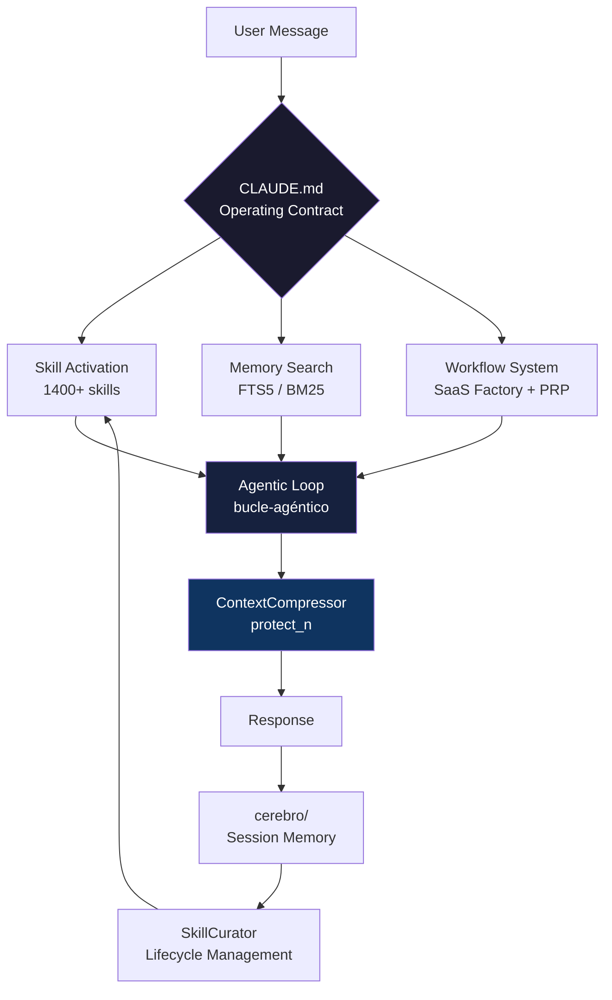
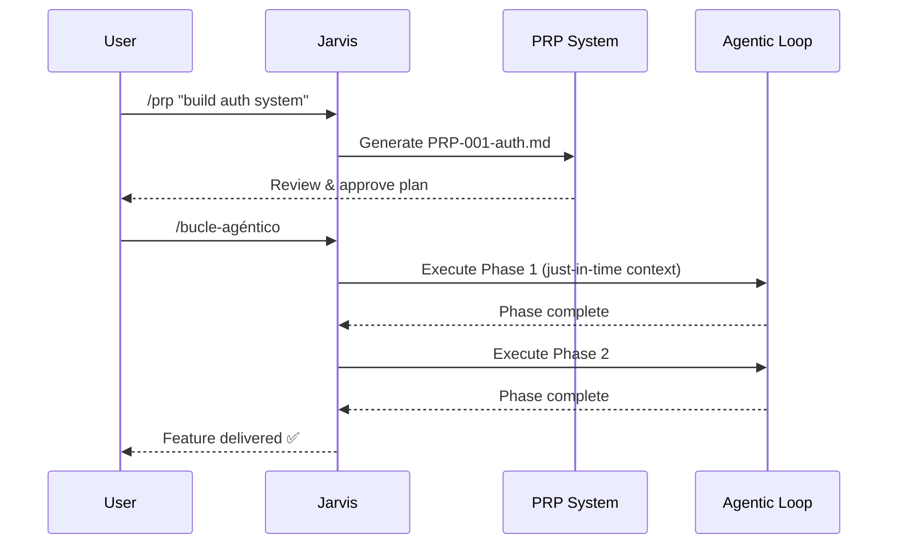

<div align="center">

<!-- BANNER PLACEHOLDER — replace with your image -->
<!--  -->

# 🤖 Jarvis-254-Agent

### The open-source AI engineering co-pilot that unifies the best the community has built — into one structured, portable system.

[](https://github.com/Ignvvcio254/Jarvis-254-Agent/actions/workflows/ci.yml)
[](LICENSE)
[](#-skills--1400-procedural-skills)
[](https://www.python.org/)
[](https://github.com/Ignvvcio254/Jarvis-254-Agent/stargazers)

**Not a replacement. Not a fork. A unification.**

[📦 Install](#-installation) · [⚡ Quick Start](#-quick-start) · [📖 Docs](docs/README.md) · [🤝 Credits](#-credits--community) · [🛠 Contributing](CONTRIBUTING.md)

---

🌐 **Language / Idioma:**
[](README.md)
[](README.es.md)

</div>

---

## 🧠 What Is This?

Most AI agent setups are good **in isolation**.

| Problem | Reality |
|---|---|
| Great CLAUDE.md contract | But no persistent memory between sessions |
| 1400 community skills | But no lifecycle curation — they rot over time |
| Powerful runtime | But no structured workflow system |
| Hermes' learning loop | But locked to one provider |

**Jarvis-254-Agent unifies them.**

It takes the best patterns from the open-source community — NousResearch/hermes-agent, Antigravity, SaaS Factory, claude-brain, and more — and composes them into a **single, structured, portable system** you can clone in minutes and run immediately.

> 💡 **We don't own any of these systems. We curate, credit, and compose them.**

---

## ⚡ Quick Start

```bash
# 1. Clone
git clone https://github.com/Ignvvcio254/Jarvis-254-Agent.git
cd Jarvis-254-Agent

# 2. Diagnose your setup instantly
python jarvis_doctor.py --repo-only

# 3. Plan your first task
python jarvis_runtime.py plan --intent "build a REST API with FastAPI"

# 4. Search your memory wiki (FTS5 BM25 — zero deps)
python jarvis_runtime.py memory search "authentication patterns"
```

> ✅ No npm. No Docker. No cloud account required.

---

## 📊 Before vs After

| Without Jarvis-254 | With Jarvis-254 |
|---|---|
| Re-explain context every session | Persistent memory wiki + FTS5 search |
| Skills rot and become irrelevant | Auto-curator marks stale, archives old |
| Single provider lock-in | Multi-provider adapter with fallback chain |
| Flat prompt files scattered | Structured CLAUDE.md operating contract |
| No workflow system | SaaS Factory: PRP + agentic loop |
| Unlimited context consumption | protect_n compression (Hermes pattern) |
| Generic agent behavior | 1400+ domain-specific procedural skills |

---

## 🏗 Architecture

```
Jarvis-254-Agent/
│
├── 🧠 CLAUDE.md              ← Agent operating contract (the core)
├── ⚙️  jarvis_runtime.py      ← Executable runtime CLI
├── 🩺 jarvis_doctor.py       ← Setup diagnostics
│
├── 💬 commands/              ← Slash commands (/memoria, /consumo, /curator...)
├── 🎯 skills/                ← 1400+ procedural skills by domain
├── 📏 rules/                 ← Engineering rules by stack
├── 💾 cerebro/               ← Persistent memory wiki (FTS5-indexed)
├── 📋 PRPs/                  ← Product Requirement Prompts (SaaS Factory)
│
├── 🔧 jarvis_core/
│   ├── cerebro_index.py      ← FTS5 BM25 search + ContextCompressor
│   ├── skill_curator.py      ← Skill lifecycle (active/stale/archived)
│   ├── providers.py          ← Multi-provider adapter
│   ├── sessions.py           ← Session store
│   └── policy.py             ← Workflow recommender
│
├── 🔌 mcp/                   ← MCP provider templates
├── 🎨 design-systems/        ← Visual design library
├── 🔒 config/                ← Sanitized config templates
└── 📚 docs/                  ← Full documentation index
```

---

## 🔄 How It All Works Together



---

## 🎯 Skills — 1400+ Procedural Skills

<details>
<summary><strong>🔍 Click to explore skill domains</strong></summary>

| Domain | Examples |
|---|---|
| 🏗 Architecture | `architect`, `ddd-strategic-design`, `microservices-patterns`, `event-sourcing-architect` |
| 🌐 Frontend | `react-best-practices`, `nextjs-app-router-patterns`, `scroll-experience`, `3d-web-experience` |
| ⚙️ Backend | `fastapi-pro`, `nodejs-backend-patterns`, `go-concurrency-patterns`, `rust-async-patterns` |
| 🔐 Security | `security-audit`, `api-security-testing`, `penetration-testing`, `web-security-testing` |
| 🤖 AI/Agents | `ai-agents-architect`, `rag-engineer`, `langchain-architecture`, `multi-agent-patterns` |
| 📊 Data | `data-engineer`, `sql-optimization-patterns`, `vector-database-engineer`, `dbt-transformation-patterns` |
| ☁️ DevOps | `kubernetes-architect`, `terraform-specialist`, `github-actions-templates`, `docker-expert` |
| 📱 Mobile | `flutter-expert`, `react-native-architecture`, `ios-developer`, `android-jetpack-compose-expert` |
| 🧪 Testing | `tdd-orchestrator`, `e2e-testing`, `playwright-skill`, `performance-testing-review-ai-review` |
| 🎨 Design | `ui-ux-pro-max`, `frontend-design`, `shadcn`, `tailwind-design-system` |
| 💼 Business | `product-manager`, `startup-analyst`, `saas-mvp-launcher`, `growth-engine` |
| 🔗 Integrations | `stripe-integration`, `supabase-automation`, `github-automation`, `slack-bot-builder` |

</details>

Skills are **auto-curated** by `SkillCurator` — stale skills marked, old ones archived. Never deleted.

```bash
# Check skill health
python jarvis_runtime.py curator --status

# Preview curation changes (safe dry-run — default)
python jarvis_runtime.py curator --verbose

# Apply curation
python jarvis_runtime.py curator --execute
```

---

## 💾 Memory System

Based on the **claude-brain** wiki pattern. Your agent remembers decisions across every session.

```
cerebro/
├── index.md      ← 🗂 Dense catalog — read this FIRST every session
├── log.md        ← 📝 Append-only change log
├── sources.md    ← 🔗 Pointers to core files
└── sessions/     ← 💬 One .md per work session
```

<details>
<summary><strong>⚡ FTS5 Search — How it works</strong></summary>

SQLite FTS5 with BM25 ranking. **Zero external dependencies.**

```bash
# Build index once
python -c "from pathlib import Path; from jarvis_core.cerebro_index import CerebroIndex; CerebroIndex(Path('.')).build(force=True)"

# Search from CLI
python jarvis_runtime.py memory search "token budget"
python jarvis_runtime.py memory search "hermes patterns" --limit 5
```

The index auto-rebuilds if not found. Persists in `cerebro/cerebro_fts.db` (git-ignored).

</details>

<details>
<summary><strong>🛡 Context Compression — protect_n contract</strong></summary>

Adopted from [NousResearch/hermes-agent](https://github.com/nousresearch/hermes-agent) `context_engine.py`:

| Parameter | Default | Effect |
|---|---|---|
| `protect_first_n` | 3 | Never compress first N messages (system context) |
| `protect_last_n` | 6 | Never compress last N messages (active session) |
| `threshold` | 75% | Compress only when context window is ≥75% full |

**Result:** Only the middle history gets summarized. Identity and coherence are preserved.

</details>

---

## 🔄 SaaS Factory — Agentic Workflow

For complex features, use the PRP system:



---

## 🩺 Doctor — Instant Health Check

```bash
python jarvis_doctor.py --repo-only   # validate structure
python jarvis_doctor.py               # full local setup check
```

```
Jarvis Doctor
== Repository Checks ==
[OK] CLAUDE.md
[OK] docs/commands.md
[OK] cerebro/index.md
[OK] PRPs/prp-base.md
...
== Summary ==
All checks passed. ✅
```

---

## 📋 Runtime Reference

```bash
python jarvis_runtime.py <command>
```

| Command | Description |
|---|---|
| `doctor [--repo-only]` | Setup diagnostics |
| `providers [--preferred X]` | Show LLM provider readiness + fallback chain |
| `plan --intent "..."` | Recommend track + commands for a task |
| `session start --goal "..."` | Start a tracked work session |
| `session list [--limit N]` | Show recent sessions |
| `memory search "query"` | FTS5 BM25 search over cerebro/ |
| `memory index [--verbose]` | Rebuild memory index |
| `memory stats` | Index stats (doc count, size) |
| `curator --status` | Show skill state breakdown |
| `curator --verbose` | Preview curation (dry-run) |
| `curator --execute` | Apply curation changes |

---

## 🛡 Security & Portability

- ❌ **No secrets, tokens, or credentials** in the repo — ever.
- ✅ All sensitive config as `{{PLACEHOLDER}}` templates in `config/`.
- ✅ `quarantine/` and `upstream/` git-ignored.
- ✅ **CI scans for leaked credentials** on every push and PR.
- ✅ `jarvis_doctor.py` validates structure before any local install.
- ✅ `tests/test_no_secrets.py` catches real credential patterns (GitHub PAT, AWS, OpenAI, Slack, Google).

---

## 🤝 Credits & Community

> **Jarvis-254-Agent does not own or claim any of the following.**
> We stand on the shoulders of giants. These projects made this possible.

| Project | Stars | What we adopted | License |
|---|---|---|---|
| [NousResearch/hermes-agent](https://github.com/nousresearch/hermes-agent) | ⭐ 134k | Curator pattern, `protect_first_n/last_n`, FTS5 memory, doctor diagnostics | MIT |
| [Antigravity / Everything Claude Code](https://github.com/anthropics/everything-claude-code) | ⭐ Community | 1400+ skill pack, skill schema, agent orchestration | MIT |
| [SaaS Factory](https://github.com/Agentic-Insights/saas-factory) | ⭐ Community | PRP system, bucle agéntico, phased workflow | MIT |
| [claude-brain](https://github.com/AgustinGoniDev/claude-brain-skill) | ⭐ Community | cerebro/ wiki system, session continuity contract | MIT |
| [Anthropic Claude Code](https://github.com/anthropics/claude-code) | — | The agent runtime everything runs on | © Anthropic |

> 📬 If you built something we use and want better attribution — open an issue. We fix it **immediately**.

---

## 🚀 Installation

See [`INSTALL.md`](INSTALL.md) for the full guide.

<details>
<summary><strong>📦 Quick install (3 commands)</strong></summary>

```bash
# Copy slash commands
cp -r commands/* ~/.claude/commands/

# Copy skills
cp -r skills/* ~/.claude/skills/

# Verify everything is correct
python jarvis_doctor.py
```

</details>

<details>
<summary><strong>🔧 Configure your CLAUDE.md</strong></summary>

Replace placeholders in `CLAUDE.md`:

```
{{YOUR_NAME}}        → your name (e.g. "Ignacio")
{{YOUR_REPO}}        → your main repo path
{{YOUR_SHELL}}       → bash / zsh / powershell
{{YOUR_OS}}          → Windows / macOS / Linux
```

</details>

---

## 📚 Documentation

| Doc | Purpose |
|---|---|
| [`docs/commands.md`](docs/commands.md) | All slash commands and their behavior |
| [`docs/command-skill-matrix.md`](docs/command-skill-matrix.md) | Command → skill → workflow mapping |
| [`docs/skills-guide.md`](docs/skills-guide.md) | How to navigate 1400+ skills |
| [`docs/saas-factory.md`](docs/saas-factory.md) | PRP + agentic workflow system |
| [`docs/runtime-lite.md`](docs/runtime-lite.md) | `jarvis_runtime.py` full reference |
| [`docs/context-compression.md`](docs/context-compression.md) | Token optimization: protect_n + FTS5 |
| [`docs/hermes-adoption.md`](docs/hermes-adoption.md) | What we adopted from Hermes and why |
| [`docs/sanitization.md`](docs/sanitization.md) | Security policy and quarantine rules |

---

## 🤝 Contributing

Read [`CONTRIBUTING.md`](CONTRIBUTING.md). Key rules:

- One PR, one concern — minimum viable changes.
- All skills need frontmatter (`name`, `description`).
- No secrets. Ever. CI will catch it.
- **Credit any external pattern you introduce.**

---

## 📄 License

MIT — see [`LICENSE`](LICENSE).

This project composes MIT-licensed community work. Attribution is explicit in the [Credits](#-credits--community) section. If you use this project, you inherit the responsibility to credit upstream sources.

---

<div align="center">

**Built with ❤️ by the community, for the community.**

*Jarvis-254-Agent is not affiliated with Anthropic, NousResearch, or any credited project.*
*We are an independent open-source composition effort.*

---

⭐ **Star this repo if it saved you time.**
🔁 **Share it if it helped your agent.**
🐛 **Open an issue if something's broken.**

</div>
